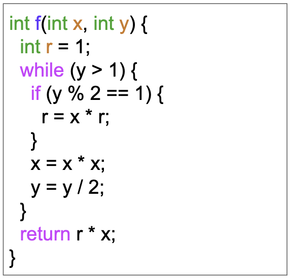
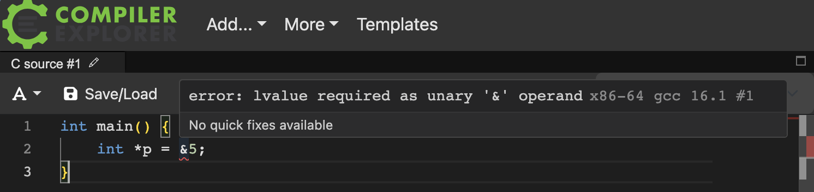
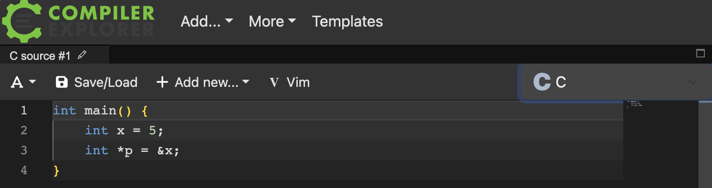
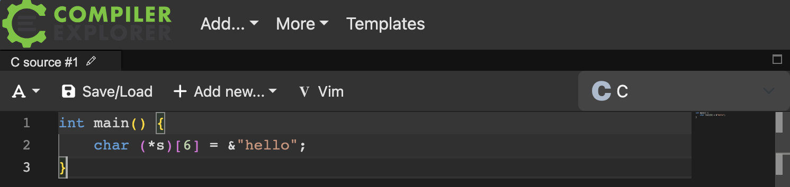

I recently finished my summer as an instructor on record for 15-122: Principles of Imperative Computation at Carnegie Mellon University for the Summer 2026 semester.
The best way to describe this course is as an introductory computer science class focusing on formal reasoning with code, data structures and algorithms,
all while using the C programming language.

## On this page

- [My journey to teaching](#my-journey-to-teaching)
- [Lessons learned](#lessons-learned)
  - [Learning only happens through struggle](#learning-only-happens-through-struggle)
  - [Teach them not to need me](#teach-them-not-to-need-me)
  - [Take them seriously](#take-them-seriously)
  - [Consistency is key to everything](#consistency-is-key-to-everything)
- [Thank you, Anne](#thank-you-anne)

## My journey to teaching

My grandmother was a teacher; she taught social studies in India. Growing up, I would hear stories about how she ran her classroom,
how she was firm but fair to her students. I had already gotten a glimpse into what it was like to teach.

In high school, I realized I was good at *coding*, and saw that a local tutoring center was hiring *coding* instructors for a summer camp.
I wanted to apply because I was inspired by my grandmother, but I'd be lying if I said that was my only motivation. The job also paid $18/hr. I ended up getting the job, and spent the summer
teaching JavaScript and Python to middle-schoolers. I enjoyed teaching, but the thing I remember the most from that summer was being
annoyed at students who just did not understand what I was teaching them.


It wasn't until Fall 2023, though, that I got to teach *computer science*. I only learned what *computer science* is after taking 15-122, and
I was captivated. I realized that coding was just a small tip of the iceberg that is CS and I was fascinated
by the way 122 started peeling back the layers. I wanted to get others excited about CS
and I thought the best way to achieve that is to be a teaching assistant for 122.

:::{.callout}
15-122 is one of CMU's largest courses. About 500 students a semester take it, and has a staff of roughly 40 TAs and two professors.
:::

I'd like to say that it was love at first sight with 122. It wasn't. My first semester as a TA was pretty uneventful, and like every new TA, I spent most of the fall just learning the ropes.
I was debating if I should even come back as a TA next semester.


But I returned for the Spring 2024 semester anyway, and with my newfound confidence as a no-longer-new-TA, I started getting more involved in the course.
I taught recitations and lab sections, and started to truly fall in love with teaching.  Because 122 is required for everyone, my recitation had USACO gold and platinum qualifiers
and people who'd memorized the C99 standard, sitting next to complete beginners. Unlike high school, I had to learn how to teach to
completely different kinds of students at once.

:::{.callout}
I had to learn to meet people where they actually were, not where I expect them to be.
:::

It was hard, and I didn't always succeed. But, when I did manage it, seeing a lightbulb go off on a student's face brought me so much joy. I felt like I wasn't just teaching, but also
sharing my immense passion for the subject, and having that passion recognized. Although I still felt a little annoyed when my students didn't understand what I was saying, I now learned to be annoyed at *myself* rather than at the students.


I kept getting more involved with 122, and after three semesters became a head TA. By the end, I had TA'ed
the course for six semesters (roughly three years), and loved every semester. Over time, I started to understand how much joy teaching brought me

I adored talking to my students. I adored stepping through an algorithm together, pretending we were the computer following instructions. I adored the tangents related to but beyond the syllabus (ex. implementing malloc, garbage collection, program verification). And I adored the hour-long conversations about the future of computer science.

Through those conversations, I learned as much from my students as they learned from me.

During my final semesters at CMU, I was not yet ready to leave teaching behind.  I had a job lined up in industry and knew I'd have little chance to teach there.
Luckily, CMU's CS department has a long history of hiring newly graduated students as summer instructors. So, I asked my professors, Iliano Cervesato and Anne Kohlbrenner
if a similar opportunity existed for 15-122. I don't think there was initially a role, but Iliano and Anne seemed to have pulled some strings
with the department to get me hired! I will be forever grateful to them for that.

:::{.callout}
Anne was an undergrad at CMU, TA'ed the course for years (she was actually the first head TA ever), and became a summer instructor immediately after graduating.
She finished her PhD at Princeton and came back to CMU as a professor teaching 15-122 full time.
:::


I couldn't believe it. I got the opportunity to teach the course I loved, at one of the best computer science programs in the world, to some of the most
talented students I would ever meet.

I hope my grandmother would be proud.

## Lessons Learned

Since this was my first time being an instructor, I learned a lot of things. I've tried to *show* you my key insights below, rather than telling them to you.
A lot of these ideas are not solely my own; they've been moulded by hours of conversations with Anne and Iliano.

### Learning only happens through struggle

In 15-122, we started the first lecture by showing students this piece of code:

{width=50%  fig-align="center" .lightbox}

and asked a simple question: what does it do? I urge you (the reader) to think about it!

Intuitively, since the function takes in two integers and outputs an integer, it *feels* like it computes some mathematical
function. But what does it actually do? It's a mystery.

I am not going to tell you what the function does. Because if I tell you right now, I would have
robbed you the opportunity to discover it yourself. You should struggle with the problem yourself: try different experiments, trace
through the code, come up with conjectures on what it could be doing, and then *prove* to yourself that your conjecture is right.
This struggle is the learning. Knowing the answer is not learning.

So, I learned to give my students the chance to really struggle. This sounds easy, but it is one of the hardest things I've ever had to do.
When a student is stuck, desperate and looking at me with puppy eyes, every instinct is to just tell them the answer.
But I had to learn to resist this at all costs. The moment I hand over the answer, I've taken the struggle away from them when that struggle
*was* the exercise.

And this is also why I still haven't told you what that function does. It's not because I'm being mean. It's because the moment I tell
you, I've robbed you of the struggle. So sit with it a little longer. I promise it'll click, and I promise it's cute.

### Teach them not to need me

This was the hardest lesson to learn. I had to realize that a good teacher isn't one who *just* answers questions.
It's one who allows students to answer their own questions.

A student came to office hours stuck on a homework problem. They had a piece of code that looked something like this:
```cpp
for (vertex u = 0; u < graph_size(G); u++) {
    neighbors_t nbors = graph_get_neighbors(G, u);
    while (graph_hasmore_neighbors(nbors)) {
        vertex w = graph_next_neighbor(nbors);
        process_edge(u, w);  // O(1) cost
    }
}
```

where `G` is a graph implemented as an adjacency list. The problem asked them to find its big-O complexity.
They looked at me and said "I'm very confused and I don't know."

I knew the answer and it would have taken me five seconds to say the answer.

Instead, I asked them a question back "Does this remind you of anything we saw in class?"
They guessed a few things, and finally it clicked that this looked a lot like the function we wrote to print a graph in lecture.
"Great," I said. "So how did we find the complexity of that one?"

After a moment, they admitted that they never really understood that part from lecture.

And that's when I realized the issue was never this homework question. They weren't stuck because this problem was hard.
They were stuck because something from an earlier lecture had never clicked.
So I explained graph print. We walked through how to reason about the cost of traversing every vertex and every edge in
an adjacency list, and how that contributes to the final complexity. They said they understood that portion of lecture a lot
better.

Then I came back to the homework problem and said "you should be able to figure it out from here" and left.

Because I am not there to give them the answer. I could have. But if I had just told them, they would have written it down,
gotten their points, and learned nothing except that I am someone who gives out answers. The next time they got stuck,
they'd come find me, which means they did not learn anything I was teaching them.

:::{.callout}
My job was never to be the answer key. It is to make my students not need one, and eventually, to not need me.
:::


### Take them seriously

This is a lesson I learned pretty quickly. I need to take their ideas seriously and test them, even when I already know it's wrong.
From a student's perspective, it is one thing to be told your idea is wrong. It is another to go on a journey which concludes in you discovering *why*
your idea is wrong. And the latter is much more valuable than the former.

Once, a student in office hours asked me about the address-of operator in C. She'd noticed that in every example, we only ever took the address of a
named variable like `&x` and she wanted to know if that was a rule. She thought that you could only do it to something with a name.

I knew that the rule was more complicated than that, but I did not immediately reject her hypothesis. Instead, I said "Yes, that seems plausible. Let's find out!"

So, I opened the [Godbolt](https://godbolt.org/) C compiler and asked her to try different examples. First, we tried to take the address of an unnamed `int`
literal `5` and saw that that produced the error:

{width=100%  fig-align="center" .lightbox}

Then, we tried to give `5` a name called `x` and take the address of `x`, which compiled fine:

{width=100%  fig-align="center" .lightbox}

She argued that this proves her hypothesis since it didn't compile when we tried taking the address of an unnamed variable, and did compile when we gave it a name.
So I asked her to try one more example -- just to be really sure -- this time by taking the address of a string literal:


{width=100%  fig-align="center" .lightbox}

But this compiled even though the literal is not a named variable!

I had proven her conjecture wrong. But now, she *had* to know why it was wrong. So, we opened the C99 standard, and the two of us looked for the passage that
discussed the address-of operator. We spent twenty minutes reading the specification, and by the end, she finally understood the rule enough to know by heart.

And of course, I am not going to tell you what the rules are.

This only happened because I was willing to say "that seems plausible" to her. If I'd brushed off the question
and just told her what the rules were, I would have robbed her of this excellent learning opportunity.

### Consistency is key to everything

There's one last thing I learned, and it took me the longest to appreciate. My job as a teacher is to make sure that every student gets a consistent experience with
the course.

If two students write down the same answer, they should get the same number of points. If two students ask the same question at office hours, they should walk away with the same answer. If two students take the course in different semesters, they should get the same course.

At first, consistency felt like bureaucracy to me. We had to maintain strong grading rubrics, grading rules, trainings/onboardings, and endless debates about whether a particular mistake should cost one point or two.
But I've realized over time that consistency is what makes everything else I've written about actually work.

For example, the first lesson I mentioned was that learning happens through struggle. A student will only choose to struggle if they trust that the struggle is worth it. The moment a student suspects that their grade is a coin flip,
that the same answer might earn full points from one TA and half points from another, they stop struggling and start gaming. They shop around for the "easy" TA at office hours. They start optimizing for points rather than their learning.
Inconsistency tells students that their effort doesn't matter, and that is the opposite of everything I was trying to teach.

:::{.callout}
Consistency is not about being fair for fairness's sake. It is what earns you the trust that lets students take the hard, slow path instead of the shortcut.
:::

But I want to be careful here because consistency is not the same as uniformity. A consistent *experience* is not the same as identical *treatment*.

Two students who ask the same question deserve the same answer. But *which* student needs *which* help is a completely different matter. The beginner who has never seen a pointer and the student who memorized the C99 standard do not need the same thing from me, and pretending they do would help neither of them. Meeting people where they are means the support is handed out by need. What has to stay constant is the bar every student is held to, and the answer every student can expect when they ask.

## Thank you, Anne

This post is full of lessons I learned about teaching. I want to end with one I couldn't have taught myself, because it belongs to Anne.

Over the summer, a lot of struggling students came to meet with me. Some meetings were ten minutes, when students knew exactly what was wrong and just needed me to point the way out. Others ran over an hour, with students who had no idea where to even begin. But one meeting was different from everything else.

It became clear pretty quickly that this student wasn't struggling because of anything in the course. They were going through a lot, and it was showing up in their performance. And I realized, sitting there, that I did not have the skills or the experience to help them with what they actually needed.
This was not a problem I could solve by asking "does this remind you of anything from lecture?"

So I asked if it would be okay for us to walk over to Anne's office. They agreed and we made the short walk from my office to hers, and I said, "Please help. I don't know what to do here."

Anne took over. She spent the next hour with that student, and by then the conversation had drifted far from 15-122. It was about life, and about help I couldn't give.

I think about that walk a lot. Every other lesson in this post is about me becoming a better teacher. This one is about knowing what I couldn't do, and being lucky enough to have someone three floors away who did know.

:::{.callout}
The best thing I did for that student all summer was admit I was the wrong person to help, and know exactly who the right person was.
:::

So, thank you, Anne. For taking over when I was out of my depth, for showing me that the most important teaching sometimes has nothing to do with the subject, and for being the person I could always walk down the hall to. I hope that one day I can be that person for someone else.